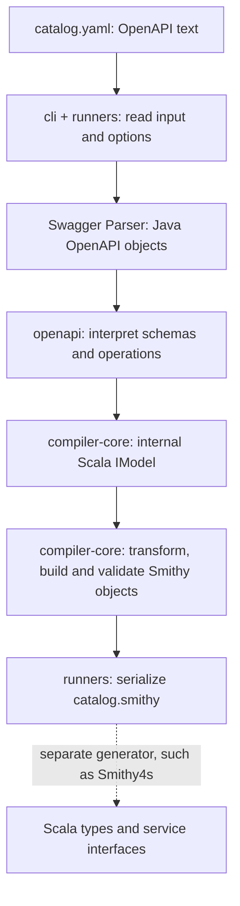

Following an OpenAPI field through Smithy Translate
==================================================

Start with [catalog.yaml](catalog.yaml) and compare it with the actual generated
[catalog.smithy](catalog.smithy). This example was run against this checkout with
both input and output validation enabled. It uses OpenAPI 3.0.3 to demonstrate
the working path; the final explanation below shows where 3.1 diverges.

**What is being generated?** Smithy Translate converts API descriptions between
formats. In this example it generates a Smithy description of an API. A separate
generator, such as [Smithy4s](https://disneystreaming.github.io/smithy4s/docs/overview/intro/),
can use that description to generate Scala data types and service interfaces.
The application supplies the business logic.



Java and Scala are programming languages used to implement these tools. This
conversion runs on the JVM, which executes compiled Java/Scala code. Scala can
call Java libraries directly: the converter uses Swagger's Java parser and the
Smithy Java model library.

Smithy describes APIs using **shapes**, meaning named types, structures, operations,
and services. A **member** is a field pointing to another shape. A Smithy
**trait**, such as `@required`, attaches meaning to a shape or member. These
concepts belong to the [Smithy model](https://smithy.io/2.0/spec/model.html).

In our generated file, `catalog#Item` identifies a structure, `catalog#Item$name`
identifies its name member, and that member targets `smithy.api#String`, a built-in
shape. `namespace catalog` supplies the namespace. For a single input file the
converter derives this namespace from the filename, `catalog.yaml`.

**Build tools and modules.** Mill builds this repository. Its dependencies are
described in [build.mill](../../../build.mill) and
[buildDeps.mill](../../../buildDeps.mill). A `moduleDeps` entry refers to another
module in this repository; `mvnDeps` refers to external libraries, distributed as
JAR files. A JAR packages compiled JVM classes and resources. Coursier fetches
published JARs and their dependencies.

| Module | Responsibility |
| --- | --- |
| `cli` | Parses command-line arguments and dispatches commands. |
| `runners` | Reads files, calls converters, and writes output. |
| `openapi` | Interprets OpenAPI through Swagger's model. |
| `compiler-core` | Shared internal model, transformations, Smithy construction and validation. |
| `json-schema` | A separate JSON Schema input path, sharing compiler-core. |
| `proto` | Converts Smithy to Protobuf definitions. |
| `formatter` | Implements the separate Smithy formatting command. |
| `traits` | Defines extra Smithy annotations used by the conversion. |

The external Alloy library supplies further shared Smithy types and traits.
The generated `smithy-build.json` records dependencies needed to interpret
these annotations. In a local development build, the project's own traits
dependency is recorded as `dev-SNAPSHOT`; using that configuration in another
tool requires making that artifact available or selecting a suitable published version.

The Scala compiler builds the translator program itself. At runtime, the
project's `OpenApiCompiler` translates an API description into a Smithy model.
These are two different uses of the word "compile".

**1. The CLI loads the example.** In
[Main.scala](../../../modules/cli/src/Main.scala), the `OpenApiTranslate` branch
calls `OpenApi.runOpenApi`. Follow it to
[OpenApi.scala](../../../modules/runners/src/OpenApi.scala).
`FileUtils.readAll` produces a `FileContents` value containing the filename and
its text. `ParseAndCompile.openapi` packages the options and calls
`OpenApiCompiler.compile` with `UnparsedSpecs`.

**2. Swagger parses the text.** The main orchestration method is inherited from
[AbstractToSmithyCompiler.compile](../../../modules/compiler-core/src/AbstractToSmithyCompiler.scala).
It starts by calling the OpenAPI-specific `convertToInternalModel` in
[OpenApiCompiler.scala](../../../modules/openapi/src/OpenApiCompiler.scala):

```scala
val result = parser.readContents(content, null, null)
```

The parser is supplied by a dependency. It constructs Java objects: an `OpenAPI`
containing paths, operations, components, and schema objects. For this 3.0.3
example, `Item.name` is represented by a `StringSchema`. No Smithy text has been
written at this point.

**3. The converter recognizes what each schema means.** In
[OpenApiToIModel.scala](../../../modules/openapi/src/internals/OpenApiToIModel.scala),
`recordAll` gathers schemas and operations. For schemas, `refoldOne` coordinates
two functions: `unfold` recognizes one layer of the input and `fold` records the
corresponding internal definition after its children have been processed.

For `Item`, `unfold` recognizes an object and visits the schemas for `name` and
`count`. For `name`, it uses `CasePrimitive` from
[Extractors.scala](../../../modules/openapi/src/internals/Extractors.scala):

```scala
case _: StringSchema | _: EmailSchema => Some(PString)
```

Read this as: if the object is an instance of either class, recognize the
converter's string primitive, `PString`. `case CasePrimitive(prim)` elsewhere
calls this extractor's `unapply` method and uses its result when it returns `Some`.

The resulting pattern is `OpenApiPrimitive(context, PString)`. The context
records where the schema came from and any annotations relevant to conversion.

**4. Patterns become the internal model.** Open
[PatternFolder.scala](../../../modules/compiler-core/src/internals/PatternFolder.scala).
Its primitive branch records a temporary `Newtype` targeting `smithy.api#String`.
Its object branch records a `Structure` containing `Field` values. Since the
parent OpenAPI object lists `name` in `required`, that field gets `Hint.Required`.

These records form the `IModel` defined in
[IModel.scala](../../../modules/compiler-core/src/internals/IModel.scala).
This representation lets the OpenAPI and JSON Schema input paths share the work
of constructing a valid Smithy model.

**5. The internal model is simplified.** Back in `AbstractToSmithyCompiler.compile`,
the next stage is
[IModelPostProcessor](../../../modules/compiler-core/src/internals/IModelPostProcessor.scala).
It applies a sequence of transformations. For our string field,
[NewtypeTransformer](../../../modules/compiler-core/src/internals/postprocess/NewtypeTransformer.scala)
removes the unnecessary temporary alias and makes the member target the built-in
string directly. Other passes handle requirements, names, unions, and more.

The relevant information now looks like this, schematically:

```text
Structure Item
  Field name  -> smithy.api#String   hints: Required
  Field count -> smithy.api#Integer hints: none
```

**6. The internal model becomes Smithy's Java model.** In
[IModelToSmithy.scala](../../../modules/compiler-core/src/internals/IModelToSmithy.scala),
`toStructure` uses the Smithy library's `StructureShape.builder()` and
`MemberShape.builder()`. The member builder receives its ID and target.
`hintsToTraits` turns `Hint.Required` into `new RequiredTrait()`.

The result is a Smithy `Model`: objects in memory with references between shapes.
`AbstractToSmithyCompiler` then assembles and validates it using the Smithy
library. This is where invalid member targets and invalid trait applications
are detected. It can also apply registered model transformers.

**7. The model becomes a file.** Back in the runner,
[ReportResult](../../../modules/runners/src/openapi/ReportResult.scala) handles
diagnostics and output. It calls
[SmithyModelUtils.getSmithyFiles](../../../modules/runners/src/SmithyModelUtils.scala),
which uses the Smithy library's `SmithyIdlModelSerializer`. The runner writes
the resulting text. With `--json-output`, it uses `ModelSerializer` instead.
Both output formats describe the same underlying Smithy model.

The field we followed appears in [catalog.smithy](catalog.smithy) as:

```smithy
structure Item {
    @required
    name: String
    count: Integer
}
```

**The HTTP parts follow a companion path.**
[ParseOperations.scala](../../../modules/openapi/src/internals/ParseOperations.scala)
reads the paths, methods, parameters, and responses. `OpenApiToIModel` records
the corresponding operation/service definitions and input/output structures.

| OpenAPI input | Generated Smithy |
| --- | --- |
| `operationId: getItem` | `operation GetItem` |
| `GET /items`, success 200 | `@http(method: "GET", uri: "/items", code: 200)` |
| Required query parameter `id` | `GetItemInput.id` with `@httpQuery("id")` and `@required` |
| JSON response referencing `Item` | `GetItem200.body: Item`, with `@httpPayload` and content type |
| The collection of operations | `service CatalogService` |

**Why this explains issue #306.** With OpenAPI 3.1, Swagger represents the name
schema as `JsonSchema`, with `types = [string]`. The class-based extractor above
does not recognize it. `unfold` returns an `OpenApiShortStop`, and the folder
records an error placeholder structure in the `error` namespace. The eventual
member therefore points at an error structure instead of the built-in string.
Fixing the parser-to-internal-model interpretation restores the information that
all later stages need.

**Scala notation useful for reading these files.**

| Notation | Meaning here |
| --- | --- |
| `object` | A singleton containing methods/values, such as `OpenApiCompiler`. |
| `case class` | A data record with generated equality and pattern matching. |
| `trait` | An interface/mixin in Scala. Smithy `@traits` are a separate annotation concept. |
| `def` / `val` | A method / a binding that cannot be reassigned. |
| `Option[A]`, `Some(a)`, `None` | A value that may be present or absent. |
| `Either[A, B]`, `Left`, `Right` | One of two alternatives, commonly an error or a value. |
| `match` / `case` | Select behavior by value, class, or record structure. |
| `F[_]`, `Writer`, `TellShape`, `TellError` | Abstractions used here to return values while accumulating definitions and diagnostics. |

The Cats library provides many of the accumulation/traversal helpers. For the
first scalar fix, understanding the extractor, the pattern it returns, and the
resulting Smithy member is enough to follow the behavior.

**Commands for this checkout.** From the repository root:

```sh
export JAVA_HOME="$HOME/.local/share/mise/installs/java/temurin-17"
export MILL_FINAL_DOWNLOAD_FOLDER="$PWD/.cache/mill"
export COURSIER_CACHE="$PWD/.cache/coursier"
mkdir -p .cache/openapi-3.1/walkthrough/smithy
./mill --no-server cli.run openapi-to-smithy \
  --input investigations/openapi-3.1/walkthrough/catalog.yaml \
  --validate-input --validate-output \
  .cache/openapi-3.1/walkthrough/smithy
```

The output directory must already exist. `./mill cli.run` runs this checkout's
code; `cs launch ...:0.7.8` runs the published version. The first CLI build also
builds the modules needed by its other commands.

For a smaller development loop, read
[PrimitiveSpec.scala](../../../modules/openapi/test/src/PrimitiveSpec.scala) and
[TestUtils.scala](../../../modules/openapi/test/src/TestUtils.scala). Tests provide
an OpenAPI string and an expected Smithy string. The helper runs the real parser
and compiler, then compares models so irrelevant text formatting does not decide
whether the test passes.

```sh
./mill --no-server 'openapi[2.13.18].test.testOnly' \
  smithytranslate.compiler.openapi.PrimitiveSpec
```

`[2.13.18]` selects the Scala version for this module; the build supports several
Scala versions. This is the command to return to after changing scalar recognition.
